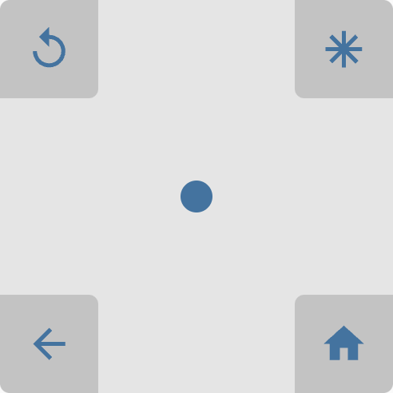

# ha-touch-pad

A touch-pad for Home Assistant that enables to use of gestures and/or corner buttons to perform actions. The initial use-case was gesture navigation support for my mobile remote controls. Currently, it **only** supports touch gestures, but I'm looking to add full mouse support in the future.



### Installation:

Install as a custom repository in HACS (see https://hacs.xyz/docs/faq/custom_repositories/ for more detailed instructions)

Alternatively, you can download the latest release from the [Releases](https://github.com/breakthestatic/ha-touch-pad/releases) page and add ha-touch-pad.js to your dashboard's resources as described in the developer documentation here -> https://developers.home-assistant.io/docs/frontend/custom-ui/registering-resources/.

### Config:

The library comes with some default settings (values noted in the table below). All configuration is completely optional. If you don't want corners, don't want _specific_ corners, don't want certain gestures, etc. just omit those properties and they won't be enabled/rendered.

Take note that for all the [ActionConfig](https://www.home-assistant.io/dashboards/actions/) definitions, you should **omit** the top-level `tap_action` and just include the map options directly, e.g.

```
up_action:
  action: call-service
  service: remote.turn_on
  target:
    entity_id: remote.living_room_tv
```

#### CardConfig:

| Name              | Type                                                              | Default                                      | Description                                                                                                                                                                                                                                                                                                                                       |
| ----------------- | ----------------------------------------------------------------- | -------------------------------------------- | ------------------------------------------------------------------------------------------------------------------------------------------------------------------------------------------------------------------------------------------------------------------------------------------------------------------------------------------------- |
| swipe_threshold   | number                                                            | `50`                                         | The minimum swipe distance for a gesture to be recognized. Gestures less than this **but greater than** the `tap_threshold` (see below) are ignored.                                                                                                                                                                                              |
| tap_threshold     | number                                                            | `5`                                          | The maximum distance from starting to ending a touch for it to be considered a tap. It's rare for a touch event to have absolutely zero movement, so this parameter allows for a bit of tolerance in movement. If you are getting unwanted tap events, lower this value. Conversely, if you aren't getting tap events when expected, increase it. |
| background_color  | string                                                            | `var(--secondary-background-color, #e5e5e5)` | The color of the touchpad itself. Accepts any valid css `background-color` value.                                                                                                                                                                                                                                                                 |
| border_radius     | string                                                            | `var(--ha-card-border-radius, 12px)`         | The curvature of both the touchpad itself, as well as the inside edges of the corner buttons. Accepts any valid `border_radius` value.                                                                                                                                                                                                            |
| cursor_size       | string                                                            | `40px`                                       | The size of the cursor (circle) representing the touch gestures.                                                                                                                                                                                                                                                                                  |
| cursor_color      | string                                                            | `var(--secondary-text-color, #727272)`       | The color of the cursor (circle). Accepts any valid css `background-color` value.                                                                                                                                                                                                                                                                 |
| tap_timeout       | number                                                            | `200`                                        | The maximum time (in ms) between touches to be considered a double-tap.                                                                                                                                                                                                                                                                           |
| up_action         | [ActionConfig](https://www.home-assistant.io/dashboards/actions/) |                                              | The Home Assistant action to perform on a swipe up.                                                                                                                                                                                                                                                                                               |
| down_action       | [ActionConfig](https://www.home-assistant.io/dashboards/actions/) |                                              | The Home Assistant action to perform on a swipe down.                                                                                                                                                                                                                                                                                             |
| left_action       | [ActionConfig](https://www.home-assistant.io/dashboards/actions/) |                                              | The Home Assistant action to perform on a swipe left.                                                                                                                                                                                                                                                                                             |
| right_action      | [ActionConfig](https://www.home-assistant.io/dashboards/actions/) |                                              | The Home Assistant action to perform on a swipe right.                                                                                                                                                                                                                                                                                            |
| tap_action        | [ActionConfig](https://www.home-assistant.io/dashboards/actions/) |                                              | The Home Assistant action to perform on a single tap.                                                                                                                                                                                                                                                                                             |
| double_tap_action | [ActionConfig](https://www.home-assistant.io/dashboards/actions/) |                                              | The Home Assistant action to perform on a double tap.                                                                                                                                                                                                                                                                                             |
| corner_size       | string                                                            | `25%`                                        | The size of the corner buttons. Accepts any valid css size unit, e.g. `50px` or `20%`                                                                                                                                                                                                                                                             |
| corner_color      | string                                                            | `rgba(0, 0, 0, 0.25)`                        | The background color of the corner buttons. Accepts any valid css `background-color` value.                                                                                                                                                                                                                                                       |
| corner_icon_color | string                                                            | `var(--primaru-text-color, #212121)`         | The color of the corner button icons. Accepts any valid css `color` value.                                                                                                                                                                                                                                                                        |
| corners           | [Corners](#corners)                                               |                                              | Configuration for the corner buttons.                                                                                                                                                                                                                                                                                                             |

#### Corners:

| Name         | Type                          | Description                                           |
| ------------ | ----------------------------- | ----------------------------------------------------- |
| top_left     | [CornerConfig](#cornerconfig) | The configuration for the top left corner button.     |
| top_right    | [CornerConfig](#cornerconfig) | The configuration for the top right corner button.    |
| bottom_left  | [CornerConfig](#cornerconfig) | The configuration for the bottom left corner button.  |
| bottom_right | [CornerConfig](#cornerconfig) | The configuration for the bottom right corner button. |

#### CornerConfig:

| Name        | Type                                                              | Description                                                                                    |
| ----------- | ----------------------------------------------------------------- | ---------------------------------------------------------------------------------------------- |
| icon        | string                                                            | The icon to render within the corner button. Accepts any valid `ha-icon` name, e.g. `mdi:home` |
| hass_action | [ActionConfig](https://www.home-assistant.io/dashboards/actions/) | The Home Assistant action to perform when tapping the button.                                  |

### Example:

```
type: custom:touch-pad
up_action:
  action: call-service
  service: persistent_notification.create
  data:
    message: Swipe Up
down_action:
  action: call-service
  service: persistent_notification.create
  data:
    message: Swipe Down
left_action:
  action: call-service
  service: persistent_notification.create
  data:
    message: Swipe Left
right_action:
  action: call-service
  service: persistent_notification.create
  data:
    message: Swipe Right
tap_action:
  action: call-service
  service: persistent_notification.create
  data:
    message: Tap
double_tap_action:
  action: call-service
  service: persistent_notification.create
  data:
    message: Double Tap
corners:
  top_left:
    icon: mdi:arrow-left
    hass_action:
      action: call-service
      service: persistent_notification.create
      data:
        message: Top Left
  top_right:
    icon: mdi:home
    hass_action:
      action: call-service
      service: persistent_notification.create
      data:
        message: Top Right
  bottom_left:
    icon: mdi:volume-minus
    hass_action:
      action: call-service
      service: persistent_notification.create
      data:
        message: Bottom Left
  bottom_right:
    icon: mdi:volume-plus
    hass_action:
      action: call-service
      service: persistent_notification.create
      data:
        message: Bottom Right

```
